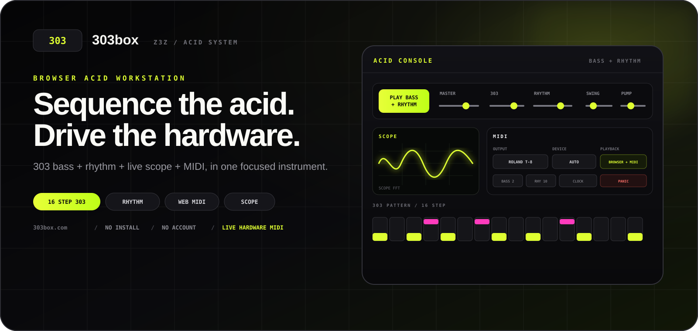

<p align="center">
  <a href="https://303box.com"></a>
</p>

<p align="center">
  <a href="https://303box.com"></a>
  
  
  
  
</p>

<h1 align="center">303box</h1>
<p align="center"><strong>Sketch the pattern here. Perform it on your hardware.</strong></p>
<p align="center">A focused 16-step browser workspace for writing, auditioning and transferring acid bass + rhythm ideas.</p>

---

## What 303box is

**303box is not an AI musician and it is not a replacement for live performance.**

It is closer to a notebook with sound:

- write a readable 16-step idea;
- audition it before committing it to hardware;
- use rule-based Random as a starting sketch, then edit it by hand;
- export the pattern as a visual reference;
- route notes and clock to supported MIDI hardware;
- finish the sound, performance and final save on the instrument itself.

Random generation is **rule-based pattern randomization**, not an AI composition model.

## Core workspace

The 303 sketchpad supports:

`NOTE` · `REST` · `TIE` · `U/D` · `ACCENT` · `SLIDE` · `SAW/SQR` · `BPM`

Browser preview controls:

`TUNE` · `CUTOFF` · `RESONANCE` · `ENV MOD` · `DECAY` · `ACCENT` · `DELAY` · `DISTORTION` · `REVERB`

The six-part rhythm sketchpad shares the same clock:

| Voice | Character |
|---|---|
| BD | 909-inspired bass drum |
| SD | 606-inspired snare |
| CP | 808-inspired clap |
| TM | 808-inspired low tom |
| CH | 606-inspired closed hat |
| OH | 606-inspired open hat |

Playback position uses the same small red playhead LED across the 303 and rhythm sequencers.

## MIDI / hardware

Playback modes:

- `BROWSER` — browser preview only
- `BROWSER + MIDI` — browser + connected hardware
- `MIDI ONLY` — hardware output only

### Hardware transfer matrix

| Device | Live MIDI | Sequencer transfer | Direct memory write |
|---|---|---|---|
| **Roland T-8** | Bass + rhythm + velocity + clock/transport | Bass REC hardware-tested; Rhythm REC beta | No SysEx memory write |
| **Behringer TD-3** | Bass + clock/transport | Live MIDI / experimental direct pattern path | Experimental USB SysEx with verification |
| **Behringer TD-3-MO** | Bass + clock/transport | Compatibility probed at runtime | Only after positive read probe |
| Korg volca bass | Notes + velocity + clock | Research / hardware verification target | No SysEx |
| Korg volca nubass | Notes + velocity + clock | Research / hardware verification target | No SysEx |

303box treats **live MIDI**, **REC capture** and **direct non-volatile memory write** as separate capabilities.

## Roland T-8 REC helper

Real hardware testing confirmed that a 303box bass pattern can be captured after REC is armed on the T-8.

The MIDI panel exposes:

- `BASS → REC`
- `RHYTHM → REC`

### Bass REC

Bass note transfer is the reliable reference workflow.

Physical T-8 testing also shows that **Accent and Slide can be captured during this workflow**. 303box therefore keeps sending both expression cues during `BASS → REC`:

- `A` is expressed with higher incoming MIDI velocity;
- `S` / legato is expressed with overlapping note timing.

A captured T-8 pattern can still sound less dramatic than the same line played live from 303box. This does **not** mean that A/S failed to record. The live MIDI stream uses explicit velocity and note-overlap timing in real time, while T-8 sequencer playback uses its stored Accent/Slide behavior. The T-8 also has a separate **Bass Accent strength** setting (`b.ACC`, 1–255), so the same Accent steps can play back softer or harder depending on the device setting.

303box does not ask the user to manually re-enter A/S steps after a successful Bass REC.

### Rhythm REC

Rhythm capture is still beta and is being tuned against physical T-8 hardware.

The current fallback deliberately mirrors the live MIDI path that already triggers the T-8 reliably:

1. Stop 303box playback first.
2. Select a disposable/empty 16-step pattern on the T-8.
3. Arm REC on the T-8.
4. Press `RHYTHM → REC` in 303box.
5. 303box sends MIDI Start just before step 1.
6. The same rhythm note/velocity path used by live playback is sent for two identical 16-step loops.
7. Inspect the T-8 pattern before using physical WRITE.

The older long clock-only pre-roll was removed because real hardware testing regressed from partial capture to no capture.

### T-8 rhythm velocity

The T-8 rhythm engine responds to incoming MIDI velocity. 303box uses a moderate T-8-specific velocity curve so live browser-driven drums sit closer to the device sequencer instead of overpowering it.

### Clock and tempo

When `SEND CLOCK` is enabled, 303box sends 24 PPQN MIDI clock so compatible hardware can follow the current browser BPM.

This is external synchronization. It does not rewrite the T-8's stored internal tempo value. If external clock disappears, the device may return to its own internal tempo.

## Why live MIDI can sound different from a recorded T-8 pattern

The important distinction is **performance behavior versus sequencer playback behavior**.

303box live MIDI sends the exact velocity and overlap timing generated by the browser pattern at that moment. During REC, the T-8 can capture the musical intent — including Accent/Slide in tested bass workflows — but once the device plays the stored pattern itself, its own sequencer and global bass settings determine the final accent strength and slide character.

So a difference in sound does not automatically mean the A/S steps were lost.

For comparisons, keep the same T-8 sound settings and pay special attention to the device's `b.ACC` Bass Accent strength before judging live MIDI against internal pattern playback.

## Hardware references

- Roland T-8: [Bass sequencer](https://static.roland.com/manuals/T-8_manual_v102/eng/28312362.html) · [Rhythm sequencer](https://static.roland.com/manuals/T-8_manual_v102/eng/28312384.html) · [MIDI implementation](https://static.roland.com/manuals/T-8_manual_v102/ptb/31849756.html)
- Behringer TD-3: [Official product information](https://www.behringer.com/en/products/0718-ABP)
- Behringer TD-3-MO: [Official product information](https://www.behringer.com/en/products/0718-ACF)
- Korg volca bass: [Official MIDI/downloads](https://www.korg.com/us/support/download/product/0/140/)
- Korg volca nubass: [Official MIDI/downloads](https://www.korg.com/us/support/download/product/0/820/)

## MIDI safety

`PANIC` is the emergency stop. It clears queued MIDI where possible, sends All Sound Off / All Notes Off, sends MIDI Stop and stops the 303box transport.

Changing browser tabs does not intentionally trigger PANIC. Real page exit still performs MIDI cleanup.

## Development note

The **software development process** has included AI-assisted coding with ChatGPT alongside direct design decisions and physical hardware testing.

That is separate from the musical behavior of the application: **303box does not use an AI composition model to make the user's music.**

## Run locally

There is no framework and no build step.

```bash
python3 -m http.server 8080
```

Then open `http://localhost:8080`.

## Current production map

```text
303box/
├── index.html
├── app.js
├── acid-console.20260818-1340.js
├── midi-router.20260818-1730.js          # MIDI routing + T-8 REC
├── hardware-guide.20260819-0815.js       # hardware transfer guide
├── bass-scope.20260818-1680.js
├── generator-router.20260818-1650.js
├── playhead-unified.20260818-1720.css
├── positioning.20260818-1740.css
├── seo.20260818-1740.js
├── sequencer-engine.20260818-1740.js
└── README.md
```

## Philosophy

**Make the drafting easier. Keep the music human.**

Write the idea, hear it, change it, take it to the machine — then perform it.

## Project

**303box is a Z3Z project.**

<p align="center">
  <a href="https://303box.com">Website</a> ·
  <a href="https://instagram.com/zafer.pro">Instagram / @zafer.pro</a> ·
  <a href="https://youtube.com/@zaferlatif">YouTube / @zaferlatif</a> ·
  <a href="https://303box.com/privacy.html">Privacy</a>
</p>

<p align="center"><sub>MIT License · 303box / Z3Z</sub></p>